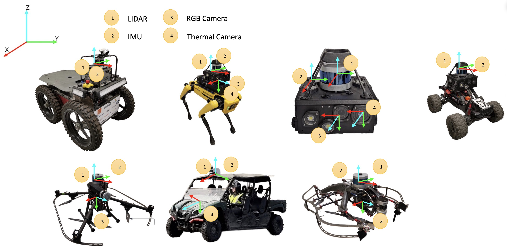
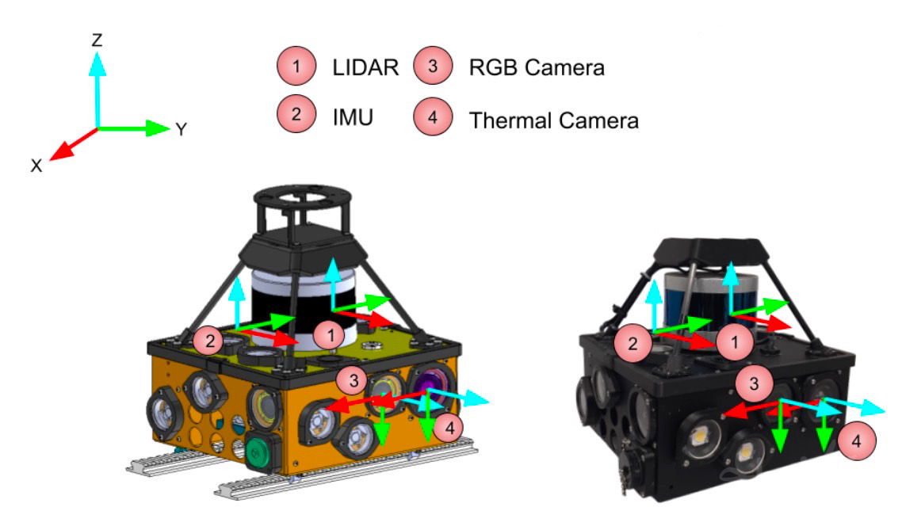
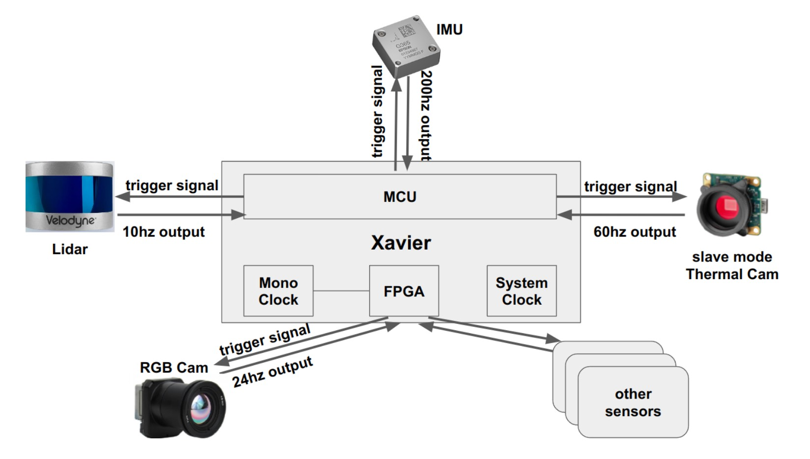

## Hardware Information
### System Overview

The dataset harnesses data from a wide variety of synchronized sensors, such as LiDAR, visual and thermal cameras, and Inertial Measurement Units (IMUs). This data is compiled from different types of vehicular movement, including aerial, legged, and wheeled motions.

### Sensor Payload
CAD(left) and actual(right) model of sensor payload: 

The sensor payload used for our dataset collection was designed by the Explorer team during the DARPA Subterranean Challenge and hasbeen assembled rigidly with the purpose of protecting the sensors from external impacts and preventing any internal vibrations. Our sensor payload is equipped with 4 Leopard Imaging RGB monocular cameras, 1 Velodyne puck, 1 Epson M-G365 IMU, and 1 FLIR Boson thermal camera. The payload has an NVIDIA Jetson AGX Xavier as its onboard computer. 

| Component       | Type                        | Rate    | Characteristics            |
| --------------- | --------------------------- | ------- | -------------------------- |
| Lidar           | Velodyne VLP-16             | 10Hz    | 16 channels, 100m range    |
| IMU             | Epson M-G365                | 200Hz   | Time Synchronization center|
| RGB Camera      | LI-Xavier-Kit               | 24Hz    | 686 × 816 pixels           |
| Thermal Camera  | FLIR Boson                  | 60Hz    | 512 × 640 pixels           |
| Computer        | Nvidia Jetson, AGX Xavier   | -       | 32GB RAM, 8CPU cores       |

### Synchronization
Time synchronization plays a critical role in any multi-sensor system and we achieve that using the pulse per second (PPS) technique. The IMU, LiDAR, and thermal camera directly use the CPU clock, whereas the 4 RGB cameras are synchronized using an FPGA board. Our experiments revealed that the time synchronization gap between any two sensors is not greater than 3ms.

Sensor hardware time synchronization paradigm:

### Calibration
#### IMU Calibration
We use the M-G365 inertial sensor1 on our platform and calibrate it to reduce bias instability and drift. We employ an Allan variance[https://ieeexplore.ieee.org/document/4404126] based tool2 to estimate the white noise angle random walk and bias instability for both the gyroscope and accelerometer data. The IMU-LiDAR calibration is done using CAD models, the data for which will be made available to the use.
#### RGB Camera Calibration
We use an open-source calibration toolbox, Kalibr3 for the intrinsic and extrinsic calibration of the RGB camera. The camera is extrinsically calibrated to the IMU. For this purpose, we use a 7×9 checkerboard, the omnidirectional camera model, and the radial-tangential distortion model. A 60s random-motion video is used for the calibration, which will be provided to the user along with other parameters.
#### Thermal Camera Calibration
Calibrating a thermal camera follows a procedure similar to that of an RGB camera, with the addition of an image processing task that requires obtaining a thermal calibration image with good contrast. This can be challenging, but we achieved it by heating a 7×9 chessboard under sunlight and feeding an inverted image from the recording into the Kalibr toolbox. Like the RGB camera, the thermal camera is also extrinsically calibrated to the IMU. This process uses a 60s random motion clip, which we provide to the user along with other essential parameters.
#### Extrinsic Calibration for Multiple Robots 
Collaborative tasks require multiple robots to operate in a common frame of reference. Our procedure to create this involves the usage of Generalized-ICP (GICP) and is two-fold. In the first step, one robot shares its map from a feature-rich location to a base station. In the second step, the remaining robots take turns solving a GICP, in the same 496 feature-rich location as the first robot and obtain a frame transformation from its own to the first robot. All the robots end up in a common frame after this procedure and build their map further using Super Odometry.

