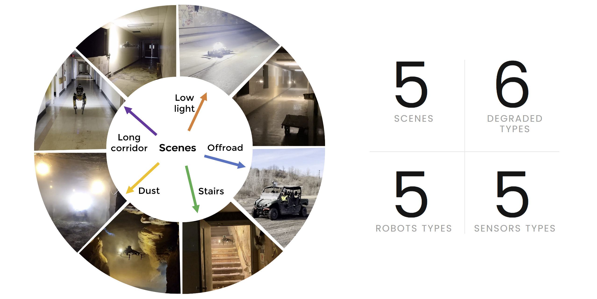

# ICCV2023_SLAM_Challenge
## 🥳 Welcome to visit our website by clicking [here](https://superodometry.com/datasets)  

We provide datasets __TartanAir__ and __SubT-MRS__, aiming to push the rubustness of SLAM algorithms in challenging environments, as well as advancing sim-to-real transfer. Our datasets contain a set of perceptually degraded environments such as darkness, airborne obscurant conditions such as fog, dust, smoke and lack of prominent perceptual features in self-similar areas. One of our hypotheses is that in such challenging cases, the robot needs to rely on multiple sensors to reliably track and localize itself. We provide a rich set of sensory modalities including RGB images, LiDAR points, IMU measurements, thermal images and so on.

### Tartan Air
The TartanAir dataset is collected in photo-realistic simulation environments based on the AirSim project. A special goal of this dataset is to focus on the challenging environments with changing light conditions, adverse weather, and dynamic objects. 

Key features of our dataset:
1. __Large size diverse realistic data:__ We collect the data in diverse environments with different styles, covering indoor/outdoor, different weather, different seasons, urban/rural.
2. __Multimodal ground truth labels:__ We provide RGB stereo, depth, optical flow, and semantic segmentation images, which facilitates the training and evaluation of various visual SLAM methods.
3. __Diversity of motion patterns:__ Our dataset covers much more diverse motion combinations in 3D space, which is significantly more difficult than existing datasets.
4. __Diversity of motion patterns:__ We include challenging scenes with difficult lighting conditions, day-night alternating, low illumination, weather effects (rain, snow, wind and fog) and seasonal changes.Please refer to the TartanAir Dataset and the paper for more information.  
🎈[You can find more information about Tartan Air from the links here](http://theairlab.org/tartanair-dataset/)

### SubT-MRS
The SubT-MRS Dataset(Subterranean, Multi-Robot, Multi-Spectral-Inertial, Multi-Degraded Dataset for Robust SLAM) is an exceptional real-world collection of challenging datasets obtained from Subterranean Environments, encompassing caves, urban areas, and tunnels. Its primary focus lies in testing robust SLAM capabilities and is designed as Multi-Robot Datasets, featuring UGV, UAV, and Spot robots, each demonstrating various motions. The datasets are distinguished as Multi-Spectral, integrating Visual, Lidar, Thermal, and inertial measurements, effectively enabling exploration under demanding conditions such as darkness, smoke, dust, and geometrically degraded environments.  

Key features of our dataset:
1. __Multiple Modalities:__ Our dataset includes hardware time-synchronized data from 4 RGB cameras, 1 LiDAR, 1 IMU, and 1 thermal camera, providing diverse and precise sensor inputs.
2. __Diverse Scenarios:__ Collected from multiple locations, the dataset exhibits varying environmental setups, encompassing indoors, outdoors, mixed indoor-outdoor, underground, off-road, and buildings, among others.
3. __Multi-Degraded:__ By incorporating multiple sensor modalities and challenging conditions like fog, snow, smoke, and illumination changes, the dataset introduces various levels of sensor degradation.
4. __Heterogeneous Kinematic Profiles:__ The SubT-MRS Dataset uniquely features time-synchronized sensor data from diverse vehicles, including RC cars, legged robots, drones, and handheld devices, each operating within distinct speed ranges.

### Sample Datasets

|Name|	Location|	Robot	|Sensors	|Description|	Degraded types	|Length|	Return to origin|	Size|	
|--|--|--|--|--|--|--|--|--|
|[Subt Canary](https://drive.google.com/drive/folders/12kpnMUsL3Kw7x90mHkyjuQ7ee4Cgp97B)|	Subt	|[subt_canary](https://drive.google.com/drive/folders/15kvOu8hSO19EVmOnZedqW5dvHnDec4Pc)|IMU, Lidar	|UAV goes in part of the subterranean environment |Geometry	|329m(591.3s)	|No	|811.2MB	|
|[Subt DS3](https://drive.google.com/drive/folders/1zsc9Byj0T8ZAicyGYvEaOOV4XEYSe6cY)|Subt|	[subt_ds3](https://drive.google.com/drive/folders/15kvOu8hSO19EVmOnZedqW5dvHnDec4Pc)|IMU, Lidar	|UAV goes in part of the subterranean environment|	Geometry|	350.6m(607.42s)|	No	|576.4MB	|
|[Subt DS4](https://drive.google.com/drive/folders/1uV94594BOcAQRlJh1ysXO6Ylf7OE2o0I)|Subt|	[subt_ds4](https://drive.google.com/drive/folders/1a560NPg1fG1gJMKXrZFpE_y6JBnorFBG)|IMU, Lidar|	UAV goes in part of the subterranean environment|	Geometry|	238m(484.7s)	|No	|308.3MB	|
|[Subt R1](https://drive.google.com/drive/folders/147tp3dgOAgNJyJsssugvmhdD9zbJLocq)|Subt|	[subt_r1](https://drive.google.com/drive/folders/1ZZ0JZTaiP59DsvJ87jxwBzQhy2L3HHaX)|IMU, Lidar|	UGV goes in part of the subterranean environment|	Geometry|	436.4m(600s)	|No	|2.11GB	|
|[Subt R2](https://drive.google.com/drive/folders/11QR9-9B1hunCFDRbl7eBe7Xjb4RhSopL)|Subt|	[subt_r2](https://drive.google.com/drive/folders/1bXSb3aQN7QmzPc8QfiTTmUihXBRgn7jA)|IMU, Lidar	|UGV goes in part of the subterranean environment|	Geometry|	536m(1909s)	|No	|1.96GB	

## The Hardware of the Datasets
[Visit the documentation for the hardware information here](Hardware_Information.md)

## Tracks of Challenges  
We provide three exciting tracks of challenges : visual Inertial Track, LiDAR Inertial Track and Sensor Fusion Track!  
You can participate either __Visual-inertial challenge__  or __LiDAR-inertial challenge__ Or __Sensor Fusion challenge__.  

## ICCV 23 Workshop Submission Requirment
See the three challenge track web pages for the requirement of estimated trajectories. The three challenge track web pages can be accessed [here](https://superodometry.com/datasets). In addition, every participating team will be required to submit a report describing their algorithm. A template for the report is [here](https://superodometry.com/Report/ICCV_Report_Template.zip).  

## FAQ
__Is the final scoring based on the aggregate performance across all three tracks?__  
Three separate awards will be given for each track. Your SLAM performance in the Sensor Fusion track will not impact the scores in other tracks.  

__May I run my own calibration?__  
While we appreciate your initiative, running your own calibration is not necessary. We have already provided both intrinsic and extrinsic calibration for each sequence. These calibrated values are carefully computed to ensure accurate results. 

__How are the submission ranked?__  
The submission will be ranked based on completeness of the trajectory as well as on the position accuracy (ATE,RPE).
We will directly use ATE and RPE to evaluate the accuracy of trajectory.  

